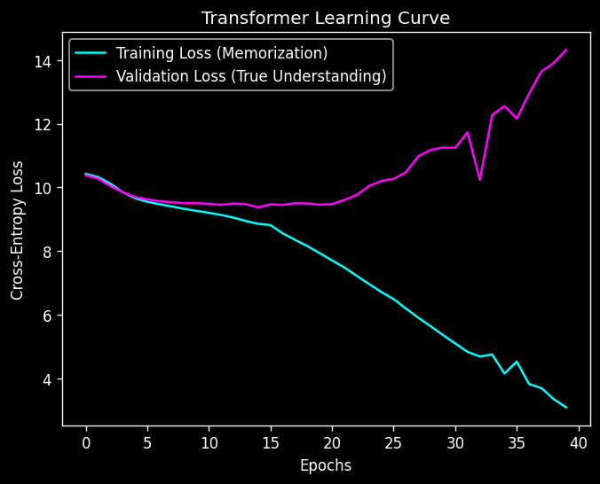

# 🎵 Transformer Song Recommender — Built From Scratch in NumPy


A next-song recommendation engine powered by a Transformer, where **every
component is implemented from scratch in pure NumPy** — no PyTorch, no
TensorFlow, no autograd library. The reverse-mode automatic differentiation
engine, self-attention, LayerNorm, the optimizer, the training loop, and the
ranking metrics are all hand-built and mathematically verified.

Trained on the Spotify Million Playlist Dataset to predict the next song in a
playlist from the songs that came before it.

---

## Why from scratch?

Anyone can call `torch.nn.Transformer`. This project exists to show I understand
what happens *underneath* it: how gradients flow backward through attention, why
LayerNorm requires a three-term gradient, how an embedding table accumulates
sparse gradients across a sequence, e.t.c. Every piece of calculus here was derived by
hand — and then **verified numerically with a finite-difference gradient check**,
so the math is provably correct rather than just plausible.

## Highlights

- **Custom autograd engine** — a `Tensor` class with reverse-mode
  backpropagation, dynamic computation graph, topological-sort backward pass,
  and broadcasting-aware gradients.
- **A full Transformer, hand-built** — scaled dot-product self-attention,
  learnable positional embeddings, LayerNorm with learnable γ/β, residual
  connections, and a position-wise feed-forward network.
- **Correct, verified backprop** — a numerical gradient check validates every
  hand-derived backward pass to ~1e-6 in double precision. (It caught a real bug
  during development — an untracked scaling op in attention.)
- **Real dataset, real evaluation** — next-song prediction on the Spotify Million
  Playlist Dataset, evaluated with **NDCG@10**
- **Clean, modular design** — separated into `engine` / `model` / `data` /
  `train` with one-directional dependencies.

## How it works

```
playlist of song IDs
   │  Embedding (learned song vectors)  +  Positional embedding (learned per-slot)
   ▼
N × Transformer blocks
     ├─ Self-attention  → Add & LayerNorm
     └─ Feed-forward    → Add & LayerNorm
   ▼
take the last position's vector  →  Linear "matchmaker"  →  scores over all songs
   ▼
softmax + cross-entropy  →  predicted next song
```

Each playlist is tokenized into integer song IDs and sliced with a sliding
window: the model sees `context_length` songs and learns to predict the next
one. The Transformer contextualizes each song against the others in the window;
the final position's representation is scored against the entire song catalog.

## Project structure

| File | Responsibility |
|------|----------------|
| `engine.py` | Autograd core: `Tensor` (with `__add__`, `__matmul__`, `relu`, `sigmoid`, `softmax`, `backward`), `Module` base class, `SGD` optimizer |
| `model.py` | Network: `LinearLayer`, `Embedding`, `SelfAttention`, `LayerNorm`, `TransformerBlock`, `SongRecommender`, and the `cross_entropy_loss` |
| `data.py` | Data pipeline: loading the Spotify JSON, building the vocabulary, tokenizing and slicing into (input, target) pairs |
| `train.py` | Orchestration: training loop, validation, NDCG@10, loss-curve plotting, weight save/load |
| `test_gradients.py` | Numerical gradient check verifying all backward passes |

Dependencies flow one way: `engine → model → train`, and `train → data`.

## Getting started

```bash
# 1. Set up the environment
python -m venv .venv
source .venv/bin/activate        # Windows: .venv\Scripts\Activate.ps1
pip install -r requirements.txt
```

```bash
# 2. Download the dataset:
#    https://www.kaggle.com/datasets/himanshuwagh/spotify-million/data
#    Place the .json slices in a  data/  folder.

# 3. Train
python train.py

# 4. Verify the autograd math
python test_gradients.py
```

## Results

Trained on 5,000 playlists (~34k-song vocabulary after min-frequency filtering),
the model reaches **NDCG@10 ≈ 0.030** on held-out playlists — up from **~0.004**
for the untrained model at initialization (~8× better than the random baseline).
The run is reproducible (`seed=42`), with the best-NDCG checkpoint kept via early
stopping on validation NDCG.

### Sample predictions (held-out playlists)

Beyond the metric, here's what the model actually recommends. Given the first
10 songs of a playlist it never trained on, it ranks all ~34k songs; the top 5
are shown against the true next song. The inputs are mainstream 2016–2017
hip-hop/rap, and the model's picks stay squarely in that lane — it learned the
playlist's *vibe*, not random songs.

**A hit:**

    Context:     … → Mask Off → Truffle Butter
    Top 5 picks: Low Life · Antidote · F*** Her Brains Out · rockstar · Broccoli
    Actual next: Broccoli   ✅ (ranked #5)

**A coherent miss:**

    Context:     … → Broccoli → Jumpman
    Top 5 picks: Mask Off · One Dance · Bounce Back · Not Nice · Back To Back
    Actual next: Teenage Fever   ❌ (not in top 5 — but every pick is the same genre & era)

The exact next track usually isn't in the top 5 (consistent with NDCG@10 ≈ 0.03),
but the recommendations are reliably genre- and era-appropriate — the model
captures mood and style even when it misses the specific song.



**Reading the curve:** training loss falls steadily while validation loss climbs —
the signature of **overfitting**. With a modest model and limited data,
the network begins memorizing training playlists rather than learning
generalizable "what-follows-what" structure. Validation NDCG still rises for a
while (ranking improves even as loss calibration degrades — they measure
different things), then plateaus as memorization takes over.

**Honest caveats:**
- **High variance** — with only ~500 validation examples and a small model,
  NDCG@10 swings across seeds/splits (observed ~0.03–0.08). The reported number
  is one *reproducible* point, not a tight estimate.
- The aim here is a **correct, from-scratch implementation**, not a
  state-of-the-art score. A 2-layer NumPy model on CPU won't rival production
  recommenders — and that's expected.

Training logs per-epoch train loss, validation loss, and **NDCG@10**, and plots
a learning curve (training vs. validation loss) to diagnose overfitting.

## Implementation notes

- **Numerically stable** softmax and cross-entropy (max-subtraction, log
  epsilon), gradient-clipped sigmoid.
- **Sparse embedding gradients** via `np.add.at`, so only the song rows actually
  used in a batch receive updates.
- **Configurable precision** (`DEFAULT_DTYPE`) — float32 for fast training,
  float64 for tight gradient checking.
- **Fused softmax + cross-entropy** backward for a clean `(predicted − target)`
  gradient.

## Future work

- Regularization to fight overfitting
- Multi-head attention and causal masking
- Adam optimizer
- A PyTorch reimplementation to benchmark correctness and speed against the
  from-scratch version

## Tech stack

Python · NumPy (numerics) · Matplotlib (plots). No deep-learning frameworks.