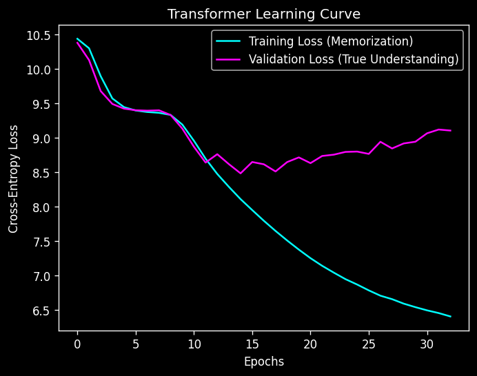

# 🎵 Transformer Song Recommender — Built From Scratch in NumPy


A next-song recommendation engine powered by a Transformer, where **every
component is implemented from scratch in pure NumPy** — no PyTorch, no
TensorFlow, no autograd library. The reverse-mode automatic differentiation
engine, self-attention, LayerNorm, the optimizer, the training loop, and the
ranking metrics are all hand-built and mathematically verified.

Trained on the Spotify Million Playlist Dataset to predict the next song in a
playlist from the songs that came before it, then **served as a REST API** in a
container that carries the trained model with it.

---

## Why from scratch?

Anyone can call `torch.nn.Transformer`. This project exists to show I understand
what happens *underneath* it: how gradients flow backward through attention, why
LayerNorm requires a three-term gradient, how an embedding table accumulates
sparse gradients across a sequence, e.t.c. Every piece of calculus here was derived by
hand — and then **verified numerically with a finite-difference gradient check**,
so the math is provably correct rather than just plausible.

## Highlights

- **Custom autograd engine** — a `Tensor` class with reverse-mode
  backpropagation, dynamic computation graph, topological-sort backward pass,
  and broadcasting-aware gradients.
- **A full Transformer, hand-built** — scaled dot-product self-attention,
  learnable positional embeddings, LayerNorm with learnable γ/β, residual
  connections, and a position-wise feed-forward network.
- **Correct, verified backprop** — a numerical gradient check validates every
  hand-derived backward pass against finite differences in double precision, to a
  max relative error of ~4e-5 against a 1e-3 threshold. (It caught a real bug
  during development — an untracked scaling op in attention.)
- **Real dataset, real evaluation** — next-song prediction on the Spotify Million
  Playlist Dataset, evaluated with **NDCG@10**.
- **Regularizers to fight overfitting** — L2 weight decay and inverted dropout (with a
  train/eval mode switch), which measurably lower validation loss and slow overfitting.
- **Deployable, not just trainable** — the trained model saves as a portable
  *bundle* (named weights + vocabulary + metadata) that a FastAPI server loads
  with no dataset present, containerized and CI-tested end to end.

## How it works

```
playlist of song IDs
   │  Embedding (learned song vectors)  +  Positional embedding (learned per-slot)
   ▼
N × Transformer blocks
     ├─ Self-attention  → Add & LayerNorm
     └─ Feed-forward    → Add & LayerNorm
   ▼
take the last position's vector  →  Linear "matchmaker"  →  scores over all songs
   ▼
softmax + cross-entropy  →  predicted next song
```

Each playlist is tokenized into integer song IDs and sliced with a sliding
window: the model sees `context_length` songs and learns to predict the next
one. The Transformer contextualizes each song against the others in the window;
the final position's representation is scored against the entire song catalog.

## From trained weights to a live API

Training and serving are two separate programs that share three files
(`engine.py`, `model.py`, `checkpoint.py`) and never import each other.

```
TRAINING  (your machine, needs the dataset)      SERVING  (a container, no dataset)
train.py                                         app.py          FastAPI routes
data.py       load + tokenize                    checkpoint.py load_bundle()
model.py      forward + backward                 recommender.py names ⇄ IDs, ranking
checkpoint.py save_bundle()  ────────────────►   artifacts/
```

The link between them is the **bundle** — a folder that makes a trained model
portable:

| File | Contents |
|------|----------|
| `weights.npz` | One array per parameter, keyed by its attribute path (`blocks.0.attention.W_query.W`) |
| `vocab.json` | Song names; the index in the list *is* the song ID *is* the embedding row |
| `metadata.json` | Sizes needed to rebuild the model, plus best NDCG, timestamp, git SHA, full config |

Two design choices make this work:

- **The vocabulary ships with the weights.** The song ↔ ID mapping is built from
  the raw Spotify JSON at training time. Without exporting it, a server would
  need the entire dataset just to translate "Mask Off" into a row index. `vocab.json`
  is ~760 KB of derived names, so the dataset itself never leaves the training machine.
- **Arrays are saved by name, not position.** `np.savez` defaults to `arr_0, arr_1, …`,
  which silently misaligns the moment a layer is added or reordered. Loading by
  name means a mismatch fails immediately, naming the exact array and its shape,
  instead of surfacing as a crash three layers deep — or as plausible nonsense.

## API

```bash
# What model is loaded?
curl https://<your-space>.hf.space/health

# Find the exact spelling the model knows
curl "https://<your-space>.hf.space/songs?q=mask"
# {"matches":["Ski Mask","Mask Off","Mask Off - Remix","Mask","Mask Off - Marshmello Remix"]}

# Recommend the next song from a 10-song playlist
curl -X POST https://<your-space>.hf.space/recommend \
  -H 'Content-Type: application/json' \
  -d '{"songs":["Shape of You","Bounce Back","T-Shirt","Good For You","I Want (feat. 2 Chainz)","Fake Love","Somebody Else","Controlla","Mask Off","Truffle Butter"],"k":5}'
# {"recommendations":[{"song":"XO TOUR Llif3","prob":0.104}, …]}
```

`/docs` serves an interactive page for all three routes.

The input rules are the model's own constraints made explicit, rather than
failures waiting to happen:

- **Fewer than 10 songs → 400.** The positional embedding has exactly
  `context_length` rows; a shorter window is out of distribution and a longer one
  has no position vector. More than 10 songs uses the last 10, which is exactly
  what a training window is.
- **A song outside the vocabulary → 400, naming every unknown song.** There is no
  `UNK` token, so an unrecognized name cannot be represented at all. `/songs`
  exists so callers can find valid spellings.
- **Input songs are excluded from results.** Recommending a song already in the
  playlist is never useful.

## Project structure

| File | Responsibility |
|------|----------------|
| `engine.py` | Autograd core: `Tensor` (`__add__`, `__matmul__`, `relu`, `sigmoid`, `softmax`, `dropout`, `backward`), `Module` base class, `SGD` with L2 weight decay, `TRAINING` flag |
| `model.py` | Network: `LinearLayer`, `Embedding`, `SelfAttention`, `LayerNorm`, `TransformerBlock`, `SongRecommender`, `cross_entropy_loss` |
| `data.py` | Data pipeline: loading the Spotify JSON, building the vocabulary, tokenizing and slicing into (input, target) pairs |
| `train.py` | Orchestration: training loop, validation, NDCG@10, early stopping, loss-curve plotting |
| `metrics.py` | Ranking metrics (`ndcg_at_k`, `hits_at_k`), shared by training and evaluation so they cannot drift |
| `evaluate.py` | Scores a finished bundle on the held-out split, with an optional untrained baseline |
| `checkpoint.py` | Bundle format: named parameter walk, `save_bundle`, strict `load_weights`, `load_bundle` |
| `recommender.py` | Serving logic: input validation, names ⇄ IDs, forward pass, softmax, ranking |
| `app.py` | FastAPI routes: `/health`, `/songs`, `/recommend` |
| `predict.py` | Sample predictions on held-out playlists |
| `test_gradients.py` | Numerical gradient check verifying all backward passes |
| `tests/` | Test suite for the bundle format, ranking rules, and API, run against a synthetic bundle |

Dependencies flow one way: `engine → model → {train, checkpoint}`, and
`checkpoint → {app, predict}`. Nothing in the serving path imports `train.py`,
which is what keeps Matplotlib out of the container.

## Getting started

```bash
# 1. Set up the environment (Python 3.10+)
python -m venv .venv
source .venv/bin/activate        # Windows: .venv\Scripts\Activate.ps1
pip install -r requirements-train.txt
```

Requirements are split so each environment installs only what it needs:
`requirements.txt` (NumPy) is the shared base, `-train` adds Matplotlib,
`-serve` adds FastAPI and Uvicorn, `-test` adds pytest.

```bash
# 2. Download the dataset:
#    https://www.kaggle.com/datasets/himanshuwagh/spotify-million/data
#    Place the .json slices in a  data/  folder. Five slices (5,000 playlists)
#    are enough for the default config.

# 3. Train  →  writes artifacts/ on every epoch that improves validation NDCG
python train.py

# 4. Verify the autograd math
python test_gradients.py

# 5. See what it recommends on held-out playlists
python predict.py

# 6. Score the trained bundle (add --baseline to compare against an untrained model)
python evaluate.py --baseline
```

Serving the trained model locally:

```bash
pip install -r requirements-serve.txt
uvicorn app:app --reload          # then open http://localhost:8000/docs
```

Training resumes only when you ask it to (`Config(resume=True)`), and refuses if
the data folder produces a different vocabulary than the bundle was trained on —
different data means different IDs, and the embedding rows would not line up.

## Results

Trained on 5,000 playlists on an M5 MacBook Air: 33,770-song vocabulary after
min-frequency filtering, 110,333 training sequences, 14,844 held out.
4.45M parameters. Early stopping ended the run at epoch 32 after ~20 minutes.

| Metric (14,844 held-out sequences) | Trained | Untrained baseline |
|---|---|---|
| NDCG@10 | 0.0330 | 0.00017 |
| True next song in top 10 | 5.9% | — |
| True next song in top 5 | 3.8% | — |
| True next song at rank 1 | 1.4% | — |

The random baseline is low because ranking is over the full catalog: with 33,770
songs, chance alone puts the right one in the top 10 about 0.03% of the time.
The trained model is roughly **190× better than chance**, which is a meaningful
result for a 2-layer model on CPU and still nowhere near a production recommender.

Reproducible at `seed=42`, with the best-NDCG checkpoint kept via early stopping
on the 3,000-sequence validation subset (best NDCG@10 there: 0.0292). Every number
in this table comes from `python evaluate.py --baseline`, which rebuilds the same
held-out split and re-scores the saved bundle.

### Sample predictions (held-out playlists)

Given the first 10 songs of a playlist it never trained on, the model ranks all
33,770 songs. The inputs are mainstream 2016–2017 hip-hop/rap, and the picks stay
squarely in that lane — it learned the playlist's *vibe*, not random songs.

**Hit:**

    Context:     … → Controlla → Mask Off → Truffle Butter
    Top 5 picks: XO TOUR Llif3 · Broccoli (feat. Lil Yachty) · Slippery · do re mi · Drowning
    Actual next: Broccoli (feat. Lil Yachty)   ✅ (rank 2)

**On-vibe miss:**

    Context:     … → Jumpman → Teenage Fever → Chanel
    Top 5 picks: XO TOUR Llif3 · Juke Jam · DNA. · Broccoli (feat. Lil Yachty) · do re mi
    Actual next: Dirty Laundry   ❌ (not in top 5)

The exact next track is usually outside the top 5 (consistent with NDCG@10 ≈ 0.03),
but the recommendations are reliably genre- and era-appropriate — the model
captures mood and style even when it misses the specific song.



**Reading the curve:** training and validation loss track each other closely for
the first ~11 epochs. The gap opens from epoch 12; validation loss bottoms out at
epoch 14 and climbs from there while training loss keeps falling — the signature
of **overfitting**. With a modest model and limited data, the network begins
memorizing training playlists rather than learning generalizable
"what-follows-what" structure. Validation NDCG still
rises for a while (ranking improves even as loss calibration degrades — they
measure different things), then plateaus as memorization takes over. Two
regularizers push back: L2 weight decay on every parameter, and inverted dropout
applied to the embedding input and each transformer sub-layer's output.

**Honest caveats:**
- **The model overfits.** With limited data and a huge input-output space,
  overfitting is expected given the model's capacity. To keep training time
  reasonable it sees only 5,000 playlists.
- **The aim is a correct, from-scratch implementation**, not a state-of-the-art
  score. A 2-layer NumPy model on CPU won't rival production recommenders — and
  that's expected.
- **Songs are identified by title alone**, so two different tracks sharing a name
  collide into one ID. Adding the artist would fix this and change the vocabulary.

## Deployment

The serving image carries the model inside it, so the container is the unit of
deployment and there is nothing to fetch at startup.

```bash
docker build -t song-recommender .        # needs artifacts/ present
docker run --rm -p 7860:7860 song-recommender
curl localhost:7860/health
```

The image listens on `$PORT` and runs as a non-root user, so it drops onto Render
or Cloud Run unchanged. [`render.yaml`](render.yaml) declares the service as a
Blueprint, so the deployment is version-controlled rather than configured by hand.
It is small enough for any free CPU tier:

| | |
|---|---|
| Bundle on disk | 19 MB |
| Peak memory, serving | 145 MB |
| Startup (load + build lookups) | 0.26 s |
| Latency per recommendation | ~2 ms |

`artifacts/` is committed to this repo rather than gitignored, which is a
deliberate trade: the host builds the image straight from a git clone, with no
model registry to fetch from and no credentials in the build. The cost is ~19 MB
of binary per committed training run. At this model's size that is worth the
simplicity; a larger model would belong in a model registry instead.

Model quality is unchanged by any of this — the deployment work makes the model
*reachable*, not better.

## Testing and CI

`test_gradients.py` is the mathematical proof; `tests/` is the engineering one.
Four jobs run on every push:

| Job | What it proves |
|---|---|
| `gradient-check` | Every hand-derived backward pass matches finite differences |
| `tests` | 39 pytest cases across the bundle format, metrics, ranking rules, and API |
| `check-image` | The gradient check passes inside a clean container |
| `serve-image` | The serving image builds from the committed bundle, starts, and answers real requests |

The test suite never touches the Spotify dataset. It builds a **synthetic bundle**
— 20 made-up songs, a tiny randomly initialized model — and runs the real save,
load, validate, rank, and serve paths against it. That is what lets CI test every
rule in seconds, on a machine that has no dataset.

Notable cases: a round trip restores every array and reproduces the forward pass
exactly; a missing array, a wrong shape, and a stale format version each raise
with the offending name; and the API's rules hold over HTTP (400 for a broken
rule, 422 for malformed JSON).

## Implementation notes

- **Numerically stable** softmax and cross-entropy (max-subtraction, log
  epsilon), gradient-clipped sigmoid.
- **Sparse embedding gradients** via `np.add.at`, so only the song rows actually
  used in a batch receive updates.
- **Configurable precision** (`DEFAULT_DTYPE`) — float32 for fast training,
  float64 for tight gradient checking.
- **Fused softmax + cross-entropy** backward for a clean `(predicted − target)`
  gradient.
- **Divergence guard** — training aborts on a non-finite loss, naming the epoch
  and batch, rather than quietly propagating NaNs through every weight.
- **Apple Silicon workaround** — NumPy's Accelerate-backed `matmul` raises
  spurious floating-point flags on finite inputs
  ([numpy#28687](https://github.com/numpy/numpy/issues/28687)), so those flags are
  suppressed for that one operation. Every other warning still surfaces.

## Future work

- Multi-head attention and causal masking
- Adam optimizer
- A `PAD`/`UNK` token, so playlists shorter than `context_length` can be served
- Artist-qualified song IDs to remove title collisions
- A PyTorch reimplementation to benchmark correctness and speed against the
  from-scratch version

## Tech stack

Python · NumPy (numerics) · Matplotlib (plots) · FastAPI + Uvicorn (serving) ·
Docker · GitHub Actions · pytest. No deep-learning frameworks.
